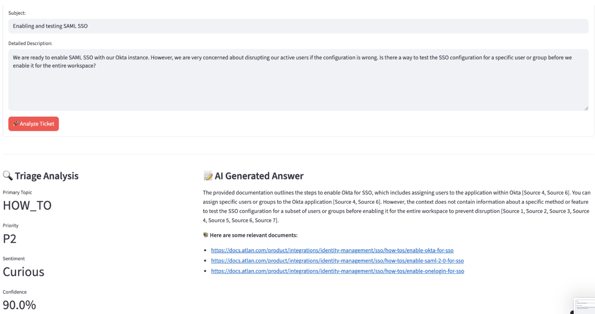

# Customer Support Copilot – Atlan Take Home Assignment

**By Suhani Jain**

## Core Questions This System Answers

The entire pipeline is designed to answer four fundamental questions for every support ticket:

### 1. "What is this ticket about?"
-   **Component**: **Smart Triage Engine** (`triage.py`)
-   **Answer**: The system uses a powerful AI model (Google's Gemini) to instantly categorize each ticket. It determines the **topic** (e.g., *SSO*, *API/SDK*, *Connector*), the customer's **sentiment**, and the ticket's **priority**. This is the crucial first step for understanding and routing.

### 2. "How confident areIabout this category?"
-   **Component**: **Real-Time Validation** (within `triage_evaluration_full.py`)
-   **Answer**: Before proceeding, the system double-checks its own work. It compares the new ticket to thousands of similar historical tickets. If the ticket's topic matches the topic of tickets it looks similar to, confidence is high. If it's an unusual or ambiguous ticket, the system flags it as low-confidence.

### 3. "What is the right answer?"
-   **Component**: **Agentic Hybrid RAG System** (`hybrid_rag.py`)
-   **Answer**: Once the system understands the ticket, it acts like an expert support agent. It searches a comprehensive knowledge base of technical docs and guides to find the most relevant information. It then writes a clear, helpful, and comprehensive response, citing the exact documents it used.

### 4. "How well is our AI system performing overall?"
-   **Component**: **Batch Evaluation Framework** (`evaluation.ipynb`)
-   **Answer**: This is our offline analytics tool. It takes a large set of classified tickets and generates reports on the system's performance. It helps us answer questions like "Are our topic categories clear and distinct?" or "Which types of tickets does the AI struggle with?". This is essential for long-term improvement.

## How It Works: A Simple 3-Step Process

When a new ticket arrives, the chatbot pipeline performs three steps in real-time:

1.  **Understand & Triage**: The AI reads the ticket and assigns it a topic and priority.
2.  **Validate & Double-Check**: It cross-references the ticket with past data to confirm its classification.
3.  **Answer with Sources**: It finds relevant documentation and generates a detailed, trustworthy response.



## Architectural Decisions: The Story Behind the Design

Our goal was to build a system that was not only technically capable but also reliable and maintainable. Each component was designed through a process of identifying a core problem, exploring solutions, and making deliberate trade-offs.


### Component 1: Intelligent Triage & Validation

**Our Thought Process & Reasoning**
The first challenge was understanding a ticket's intent. Manual reading is slow, and simple keyword-based rules are too brittle to handle the variety of customer language. We needed structured, predictable data from unstructured text. Our initial experiments with older models yielded inconsistent, free-text outputs that were difficult to parse reliably. The breakthrough came with modern LLMs that support structured outputs. We realized we could solve the consistency problem by forcing the model to fill out a predefined "form" instead of writing on a blank page.

Furthermore, we quickly learned that forcing a ticket into a *single* category was a mistake. A customer asking about "connecting Snowflake via SSO" has two distinct problems: `Connector` and `SSO`. Forcing a single label would mean losing crucial context. We therefore designed the system to embrace this complexity and identify *all* relevant topics for a given ticket.

**Technical Implementation:**
* **Model**: Primary Method: Gemini 1.5-8b with Pydantic JSON output for consistent classification. We chose a smaller model because this task does not require deep reasoning, making it a cost-effective choice. Ideally, for production, this would be a self-hosted, fine-tuned SLM.
* **Structured Output**: The model's output is constrained to a **Pydantic schema** (`TicketFeatures`), which guarantees every classification is a valid, machine-readable object with fields for `topics` (as a list), `priority`, `sentiment`, etc.
* **Multi-Label Classification**: The prompt explicitly instructs the model to identify one or more topics from a predefined list, ensuring we capture the full scope of the user's issue.

**Trade-offs and Future Direction:**
* **Trade-off**: Using a state-of-the-art cloud API like Gemini provides high accuracy but comes with latency and operational costs. We are also dependent on an external service.
* **Future Vision**: The long-term goal is to fine-tune a smaller, **self-hosted open-source model** (like Llama 3 or Mistral). By training it on our own ticket data, we could achieve comparable or even better performance at a fraction of the cost, with greater speed and full control over the infrastructure.

### Component 2: Validation - Building Trust Without Labels

**Our Thought Process & Reasoning**
An AI classification is useless without a measure of confidence. We wanted to build a system to evaluate the triage step, much like the process described in a few industry articles. The problem was, those approaches required a large, manually labeled dataset, which we didn't have. So, we had to find another way.

Our first idea was to use unsupervised clustering. The logic was simple: if we cluster all tickets classified as "SSO," they should be semantically similar to each other. We could measure the coherence of that cluster. However, we immediately ran into the multi-label problem again. A ticket tagged as both `SSO` and `Connector` would pollute both clusters, making simple coherence an unreliable metric.

This led us to our solution: instead of checking if a ticket fits into a *pre-defined* group, let's see what *natural* group it falls into and then check if the labels make sense. We build a graph of all recent tickets, connecting those that are semantically similar. This reveals the true, underlying clusters of issues. We can then check if a ticket's assigned labels agree with the dominant labels of its natural cluster.

**Technical Implementation:**
* **Semantic Embeddings**: We use a `SentenceTransformer` model to convert the salient text of each ticket into a vector embedding.
* **Graph-Based Clustering**: We build a similarity graph using `networkx`, where nodes are tickets and weighted edges connect tickets with high cosine similarity. The connected components of this graph form our natural clusters.
* **Coherence analysis**:  to measure how well tickets cluster by their assigned topics (Topic Coherence > 0.6).
* **Confidence scoring**: for individual tickets based on the margin between the assigned topic and the next best alternative. This flags problematic tickets for human review (margin < 0.2 threshold).

**Trade-offs and Future Direction:**
* **Trade-off**: This unsupervised method provides a powerful *proxy* for confidence but not an absolute "correct/incorrect" score. The similarity threshold used to build the graph is a sensitive hyperparameter that requires tuning.
* **Future Vision**: This validation system is also a powerful engine for active learning. The tickets it flags with low confidence are precisely the most valuable ones for a human to review and label. By creating a feedback loop where humans label these ambiguous tickets, we can build a high-quality dataset over time. This dataset will eventually allow us to train a much more accurate, supervised triage model.

### Component 3: RAG - Agentic Hybrid RAG System

**Our Thought Process & Reasoning**
Once we understand a ticket, we need to provide an answer. Simply asking an LLM is a recipe for disaster, as they are prone to "hallucinating" incorrect information. The answer had to be grounded in facts from our official documentation. The obvious solution is Retrieval-Augmented Generation (RAG).

However, a basic RAG system often falls short. We found that semantic search is great for conceptual questions ("how does lineage work?"), but terrible for specific keywords, product names, or error codes. Conversely, keyword search is great for specifics but fails when users describe their problem in different terms. Relying on just one felt like a compromise. We decided we didn't have to choose. A hybrid approach that uses both methods would be far more robust.

Finally, even with the right documents, the LLM still needs to be constrained. We designed a strict "constitution" for our generator: it must base its answer *only* on the provided sources and cite every single claim.

**Technical Implementation:**
* **Query Analysis Agent**: Analyzes user intent to select the optimal retrieval strategy (e.g., lexical-heavy for API questions, semantic-heavy for best practices).


* **Hybrid Retrieval**: Combines traditional **BM25 (keyword search)** for precision and **dense vector embeddings (semantic search)** for intent. This combination showed a 20-25% improvement in retrieval coverage versus either method alone.
* **Reciprocal Rank Fusion (RRF)**: Intelligently merges results from both retrieval methods, prioritizing documents that rank highly in both lists.

* **Reranking Agent** : Gemini-powered response generation with a carefully engineered few-shot prompt that tracks sources and ensures every claim is attributed.

**Trade-offs and Future Direction:**
* **Trade-off**: This multi-step RAG pipeline is more complex and has higher latency than a direct LLM call. The quality of its answers is also fundamentally limited by the quality and comprehensiveness of the knowledge base. If information isn't in the docs, the bot can't answer.
* **Future Vision**: The system could be made self-improving. By analyzing the text from successfully resolved tickets, we could automatically identify gaps in our documentation and even draft new knowledge base articles. We could also explore more advanced retrieval techniques, like breaking down complex user questions into multiple sub-queries to retrieve more precise information for each part of the problem.

---

## Quick Start

### Prerequisites
- Python 3.8+
- API access to Google Gemini

### Local Setup
1.  **Clone and navigate to the project:**
    ```bash
    git clone [https://github.com/suhanijain1/Atlan_helpdesk_RAG.git](https://github.com/suhanijain1/Atlan_helpdesk_RAG.git)
    cd atlan
    ```
2.  **Install dependencies:**
    ```bash
    pip install -r requirements.txt
    ```
3.  **Set up environment variables:**
    ```bash
    cp .env.template .env
    # Add your Gemini API key to the new .env file
    ```
4.  **Run the system:**
    ```bash
    streamlit run app.py 
    ```


### Knowledge Base Creation Process
**Knowledge Base:** 61 comprehensive documents covering:
- SSO Integration (25 docs) - Azure AD, Okta, Google, SAML setup guides
- API/SDK Documentation (21 docs) - Developer guides, code examples
- Product Features (5 docs) - Core capabilities and workflows
- How-to Guides (6 docs) - Step-by-step instructions
- Best Practices (4 docs) - Governance and administration guidance


**Challenge:** Building a comprehensive knowledge base required systematically scraping Atlan's documentation across multiple domains.

**Solution:** Developed `comprehensive_scraper.py` with targeted URL collection:

**Scraping Strategy:**
1. **Manual URL Curation:** Identified authoritative documentation URLs for each topic area
2. **Smart Content Extraction:** Used BeautifulSoup with multiple CSS selectors to extract clean content
3. **Automatic Categorization:** Classified documents by topic based on URL patterns and content analysis
4. **Quality Filtering:** Only retained documents with substantial content (>500 characters)
5. **Deduplication:** Removed duplicate documents based on URL matching

**Sources Scraped:**
- **SSO Documentation** (6 core URLs → 25 docs): Complete setup guides for Azure AD, Okta, Google, SAML
- **API/SDK Documentation** (7 developer URLs → 21 docs): Getting started guides, SDK references, code examples
- **Product Documentation** (7 core URLs → 5 docs): Feature overviews, capabilities, workflows
- **How-to Guides** (6 URLs → 6 docs): Step-by-step setup instructions for connectors
- **Best Practices** (4 URLs → 4 docs): Administration and governance guidelines

**Technical Implementation:**
```python
# Example from comprehensive_scraper.py
documentation_urls = {
    'SSO': [
        'https://docs.atlan.com/product/integrations/identity-management/sso',
        'https://docs.atlan.com/product/integrations/identity-management/sso/how-tos/enable-azure-ad-for-sso',
        # ... more URLs
    ],
    'API/SDK': [
        'https://developer.atlan.com/getting-started/',
        'https://developer.atlan.com/sdks/',
        # ... more URLs  
    ]
}
```

**Result:** High-quality knowledge base with 61 documents totaling 276,348 characters, enabling accurate response generation with proper source attribution.

**Why Hybrid Retrieval:**
- **BM25 (Sparse):** Excellent for exact matches, technical terms, product names
- **Semantic (Dense):** Handles paraphrases, synonyms, conceptual similarity  
- **Combined:** 20-25% improvement in retrieval coverage vs either method alone

##  Usage

### Complete System
```bash
# Launch integrated interface with full pipeline
streamlit run app.py
```

Features:
- Submit support tickets through web interface
- Real-time classification with confidence scores
- Comprehensive response generation with source citations
- Evaluation dashboard showing classification quality
- Interactive knowledge base search

### Original Classification Pipeline
```bash
# Run the original triage classification system
python pipeline/main.py

# Results saved to:
# - classification_results.json
# - triage_results/ (evaluation metrics and plots)
```

### Individual Component Testing

**Hybrid RAG System:**
```bash
python -c "
from hybrid_rag import AgenticHybridRAG
rag = AgenticHybridRAG()
result = rag.answer_question('How do I set up SSO with Azure AD?')
print(result['answer'])
"
```

**Classification Only:**
```bash
python -c "
from atlan_helpdesk_pipeline import AtlanHelpdeskPipeline
pipeline = AtlanHelpdeskPipeline()
result = pipeline.classify_ticket('Cannot login to Snowflake')
print(result)
"
```

**Evaluation Framework:**
```bash
python triage_evaluation_full.py
```

## 📊 Key Files

**Core System:**
- **`app.py`** - Complete Streamlit interface for the full system
- **`atlan_helpdesk_pipeline.py`** - Main pipeline orchestrator integrating all components
- **`hybrid_rag.py`** - Agentic hybrid RAG system with multi-modal retrieval
- **`comprehensive_scraper.py`** - Documentation scraper that built the knowledge base

**Original Triage System:**
- **`pipeline/main.py`** - Original classification pipeline entry point
- **`pipeline/feature_extractor.py`** - Gemini-based ticket classification
- **`pipeline/evaluation.py`** - Clustering and coherence evaluation
- **`triage_evaluation_full.py`** - Enhanced evaluation framework

**Data:**
- **`atlan_knowledge_base.json`** - Comprehensive Atlan documentation (61 docs)
- **`sample_tickets.json`** - Test tickets for pipeline validation

## 🔧 Configuration

Edit configuration in:
- **`pipeline/config.py`** - Classification and evaluation parameters
- **`atlan_helpdesk_pipeline.py`** - Main pipeline settings
- **`.env`** - API keys and environment variables

Key settings:
- Model selection (Gemini Flash vs Pro)
- Classification confidence thresholds  
- Retrieval fusion weights
- Evaluation clustering parameters

## 📈 Results & Performance

Detailed in evaluation.py

## Deployment

The system is deployed with:
- Streamlit community
- Environment-based configuration

##  References & Acknowledgments

This project builds on established patterns in:
- Hybrid retrieval systems (BM25 + dense embeddings)
- Agentic RAG architectures with specialized components
- Clustering-based evaluation for classification validation
- Multi-dimensional ticket classification approaches

---

**Contact:** Suhani Jain | [GitHub](https://github.com/suhanijain1) | Built for Atlan Take Home Assignment
